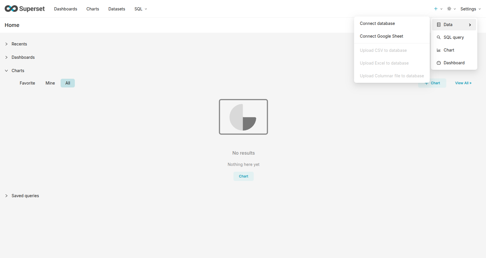
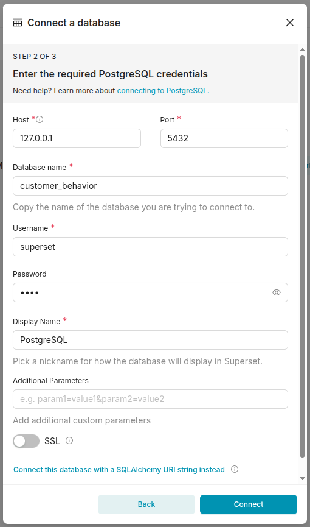

# Setting up Superset

The aim is to show an step by step for install(via python), cofigure Superset. I am using PostgresSQL. So this guiede assume
that PostgreSQL is already instaled.

From postgreSQL we will need user with read acess to use in
Superset.

> [!WARNING]
> Tutorial for Debian and Ubuntu

## Configure PostgreSQL

### create an analytic(read only access) role in PostgreSQL
 ```bash 
 sudo -i -u postgres
 ```
 ```bash 
 sudo -i -u postgres
 ```
```SQL
CREATE ROLE analytic LOGIN;

-- Grant database and schema access
GRANT CONNECT ON DATABASE customer_behavior TO analytic;
GRANT USAGE ON SCHEMA public TO analytic;

-- Read all existing tables and views
GRANT SELECT ON ALL TABLES IN SCHEMA public TO analytic;

-- Access existing sequences
GRANT USAGE ON ALL SEQUENCES IN SCHEMA public TO analytic;

-- Execute existing functions
GRANT EXECUTE ON ALL FUNCTIONS IN SCHEMA public TO analytic;
```

**Automatically grant privileges on future objects**
```SQL
ALTER DEFAULT PRIVILEGES IN SCHEMA public
GRANT SELECT ON TABLES TO analytic;

ALTER DEFAULT PRIVILEGES IN SCHEMA public
GRANT USAGE ON SEQUENCES TO analytic;

ALTER DEFAULT PRIVILEGES IN SCHEMA public
GRANT EXECUTE ON FUNCTIONS TO analytic;
```

> [!TIP]
> The correct approach is use an specific schema(dataset) and grant acess to it
>  not use the public

Ref [here](https://www.crunchydata.com/blog/creating-a-read-only-postgres-user)


### Create a user with read only access
 ```bash 
 sudo -i -u postgres
 ```
 ```psql <dbname>
 ```

```SQL
CREATE USER superset WITH ENCRYPTED PASSWORD '<PASSWORD>';
GRANT analytic TO superset;
```

## Installing Superset(via Python)

For installation details check the official documentation of Superset [here](https://superset.apache.org/admin-docs/installation/installation-methods)

For Another good reference for "Set Up Apache Superset on Your Local Machine"
check [here](https://medium.com/@ruthikkumbhar/how-to-set-up-apache-superset-on-your-local-machine-step-by-step-guide-0b18ed82d3f2)


### install dependecies
```bash
sudo apt-get install build-essential libssl-dev libffi-dev python3-dev python3-pip python3-venv libsasl2-dev libldap2-dev libpq-dev default-libmysqlclient-dev pkg-config
```

Refer to the [pyproject.toml](https://github.com/apache/superset/blob/master/pyproject.toml) file for the list of Python versions officially supported by Superset, and install a matching ```python3``` interpreter for your distribution. The ```libpq-dev``` package is only needed if you intend to connect to (or use) a PostgreSQL database; you can omit it otherwise.

## Python Virtual Environment

We will use an exclusive venv to install and run Superset inside the dir of our nootebook.

### Create and activate venv
```bash
python3 -m venv .superset-venv
source .superset-venv/bin/activate
```

## Installing Superset

### Install apache_superset
```bash
pip install apache_superset rich cachetools psycopg2-binary
```
#### pin Flask-Caching to version 2.4.1.

This action is related to [Superset 6.1.0 is incompatible with Flask-Caching 2.5.0]() issue on the current version of Superset(6.1.0).

Run these commands inside your activated virtual environment:
```bash
python -m pip uninstall -y Flask-Caching

python -m pip install "Flask-Caching==2.4.1"

python -m pip show apache-superset Flask-Caching cachelib
```


### Define mandatory configurations, SECRET_KEY and FLASK_APP
**Create the configuration file**
```bash
touch superset_config.py
```
**Generate an secret key**
```bash
openssl rand -base64 42
```
**Put the following content in the file**
```bash
SUPERSET_SECRET_KEY=<GENERATED-SECRET-KEY>
FLASK_APP=superset
```
**Configure Superset to load it**
```bash
export SUPERSET_CONFIG_PATH="$(pwd)/superset_config.py"
```

###  initialize the database
And idependent database used by Superset to persist metadata

```bash
superset db upgrade
```

### Create an Administrator Account
```bash
superset fab create-admin
```
Example:
```bash
Username: admin
First name: Admin
Last name: User
Email: admin@example.com
Password: ********
````

### Initialize Superset
```bash
superset init
```

**Start Superset(Developmente web server)**
```bash
superset run -p 8088 --with-threads --reload
```

### config DB connection in superset
Acess Superset interface in Browser acessing ```http://127.0.0.1:8088```.

- In superset interface go to Data>Connect database
- Select PostreSQL in "Select a database to connect" section
- Fill the filds with correspondent informations, click on connect
- And finish

Look the images below:



